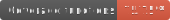

> CI/CD status

[](https://app.netlify.com/sites/design-portal-vnext/deploys)
[](https://github.com/avaya-dux/design-portal/actions/workflows/run-yarn.yml)

> react unit test code coverage





# Welcome to the Design Portal V3

> this is a "v-next" of the Design Portal and is a work in progress

## 🚀 Project Structure

As this is an Astro project, it should adhere to the following Astro best practices:

```
/
├── public/
│   └── favicon.ico
├── src/
│   ├── components/
│   │   └── Layout.astro
│   └── pages/
│       └── index.astro
└── package.json
```

Astro looks for `.astro` or `.md` files in the `src/pages/` directory. Each page is exposed as a route based on its file name.

There's nothing special about `src/components/`, but that's where we like to put any Astro/React/Vue/Svelte/Preact components or layouts.

Any static assets, like images, should be placed in the `public/` directory.

**When adding a new page**, you _must_ add an exported `title` and `description`. This is what the "Search" component uses to populate itself.

## Other Notes

[CodeSee Diagram](https://app.codesee.io/maps/public/1cb8aa50-346c-11ed-8880-add58adad48c)
