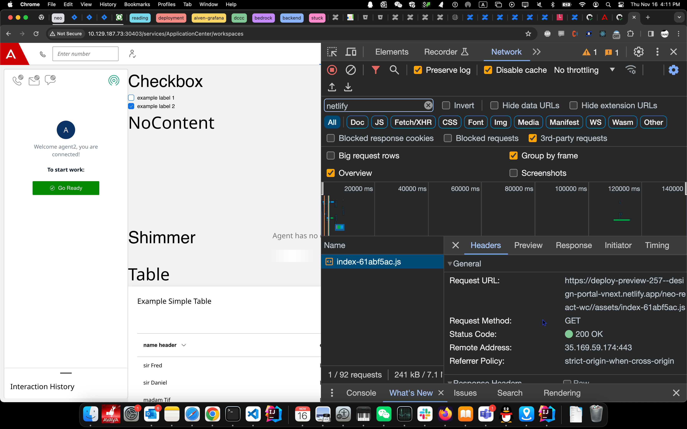

# Two ways to overview web components

## Use Astro dev server

- Naviagte to http://localhost:4321/neo-react-wc/index.html

## Use Live Server

- right click on /public/neo-react-wc/index.html, open in live server

Under Edit Profile

start live server at 5500
ngrok http 5500 and copy the url and past in under library url:
enable widget library: https://338f-70-110-132-205.ngrok-free.app/public/neo-react-wc/

If it is hosted on netlify:
put in this libary url
https://deploy-preview-257--design-portal-vnext.netlify.app/neo-react-wc/

